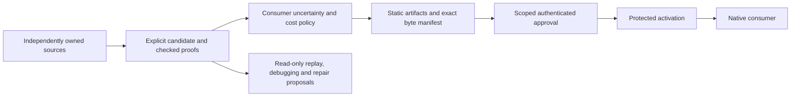

# Consumer lifecycle and migration

MetaMap separates possible correspondences, checked consumer expressions,
authenticated approval and active state. Stable semantic IDs name the resource;
an implementation locator is a binding that may change. Discovery does not grant
authority and compilation does not activate anything.

## Runnable walkthrough

Run `npm run example:lifecycle`. The public example reads two independent source
shards from the existing provenance fixture, rechecks a dependency derivation and
consumer budget, prepares exact native files, and verifies synthetic Ed25519 owner
approval through the governed `MetamapActivator` interface. It executes generated
bindings before and after a locator move and after freshly approved rollback.
Semantic identities survive; changed artifact bytes require a new approval.

Run `npm run verify:package` to pack the current built artifact, install that
archive in a disposable consumer outside the checkout, import every public
module/JSON export, and execute the packaged lifecycle with native TypeScript
checks. Installation uses the declared dependencies and runs no install scripts.
The disposable consumer and archive are removed after the check.

The script tests that stale approval, tampered output, missing or ambiguous
bindings, insufficient cost budget, unsupported inference, and strict unknown
evidence preserve the previous active state. A structurally viable agent-proposed
authority expansion remains visible but cannot be self-approved. Synthetic private
keys stay in memory and are never exported. This portable example exercises the
**synthetic in-memory** activation interface; it does not install a production
promoter or establish independent operating-system permissions.

The actual protected boundary is the root-owned Linux profile in
[ACTIVATION.md](ACTIVATION.md), using the packaged fixed promoter
`examples/activation/promoter.mjs`. The native Linux acceptance suite tests a
separate unprivileged UID, exact protected artifact consumption, denial of direct
state/runtime/trust writes, stale/concurrent requests, and SIGKILL recovery at all
five transaction phases. The supported clock, trust configuration, runtime and
storage come from the consumer host. Do not select them from incoming requests.
Other operating-system/owner profiles require their own acceptance. SIGKILL
coverage does not establish power-loss guarantees.

## Complete scenario coverage

| Scenario                                                     | Runnable evidence                                                                                 |
| ------------------------------------------------------------ | ------------------------------------------------------------------------------------------------- |
| Actual moved implementation and native handler execution     | `example:bindings`, plus signed locator/binding changes in `example:lifecycle`                    |
| Missing/ambiguous binding and preserved active state         | `example:lifecycle`, native binding and activation regression suites                              |
| Allowed composition and unsupported inference                | `example:relations`, checked lifecycle proof and unsupported-law case                             |
| Tolerant/strict uncertainty and cost budget                  | `example:uncertainty`, lifecycle evidence and budget rejection                                    |
| Viable agent authority expansion and scoped approval         | `example:lifecycle`, governance and protected write-boundary tests                                |
| Stale/tampered request and rollback                          | `example:lifecycle`, actual protected promotion/UID/crash cases                                   |
| Bounded repair and read-only inspection                      | `example:repair`, `example:explain`, `example:debugger`                                           |
| Scientific IDs, duplicate assertions and source preservation | `example:scientific-source`, `example:scientific` and independent format/crate checks             |
| Legacy consumer behavior and IDs                             | Pinned legacy regression suite and separate downstream route/topology/application adoption checks |

The repair, explanation and inspection examples capture their own evaluations and
verify source/existing-output preservation. Passing a repair evaluation proposes
an alternative; it does not edit the owned source or active manifest. The shared
debugger exposes proof, original issue subjects, unknown evidence and changed
origins without fetching or executing input. [REPAIR.md](REPAIR.md) and
[DEBUGGER.md](DEBUGGER.md) define their bounds. [SCIENTIFIC_MAPPING.md](SCIENTIFIC_MAPPING.md)
defines the licensed single scientific profile; successful lookup/provenance
checks do not establish biological identity or scientific truth.

## Migration decisions

Legacy graph2.0, policy/generation/projection1.0 and relation-pack1.0 retain their
documented behavior and pinned identities. Update the engine separately from
opting into stronger semantics or governed activation. A dependency upgrade alone
does not provide trusted keys, owner grants or an activation decision.

Opt-in relation-pack2.0 supplies explicit executable laws. Policy2.0 binds proof,
typed assessments, requirements and consumer budgets; generation/projection2.0
bind their checked interpretation. Complete source capture requires replay3.0,
not fabricated v2 receipt fields. Missing mandatory inputs and mixed versions
reject. [CONTRACTS.md](CONTRACTS.md), [RELATIONS.md](RELATIONS.md),
[UNCERTAINTY.md](UNCERTAINTY.md) and [PROVENANCE.md](PROVENANCE.md) specify the wires.
Published schemas and packs remain immutable; select a new contract for a new
mandatory interpretation.

Historical replay requires its recorded executor, dependency/runtime identity,
inputs and selected packs. A newer library reports an executor mismatch rather
than pretending to reproduce old semantics. Preserve the matching released
executor or approved archived fixture. Replay's historical evaluation clock is
separate from present approval expiry/revocation and active-state freshness.

Before governed adoption, the consumer owner fixes its environment, immutable
runtime/promoter, protected storage, allowed proposal paths, principals, keys,
scoped grants and trusted clock. Review the entire proposal delta and recomputed
artifact inventory, sign exactly that payload using an external owner signer,
then submit the fixed activation request. Graph producer names and evidence
assessors are declarations, not automatically trusted approving identities.
Production signing credentials never belong in graph/replay/proposal files.

## Failure recovery and rollback

A pre-commit rejection leaves the prior active pointer/artifacts intact. A
post-commit interruption can be indeterminate: read protected state and reconcile
the exact manifest before retrying. An exact active request is idempotent only
under the documented current authorization conditions. Do not infer retirement of
an existing activation solely from a newly revoked grant; revocation prevents
new approvals/activation under the specified rules.

Rollback is a new proposal against the **current** protected baseline, using the
desired older captured candidate and freshly scoped owner approval. It generates
a new activation manifest with a previous-manifest link. Verify the manifest and
native bytes after promotion. Do not overwrite the active pointer manually, reuse
an old approval, edit immutable activation directories or rewrite Git history.

The former Seeder consumer (now Avaelus) keeps its authored routes, policy,
topology and generator ownership. Its upgrade is a separate reviewed change:
pin a published immutable MetaMap revision and schema URL, refresh a portable
lockfile, regenerate through its existing commands, compare cached/uncached
outputs and run route/topology plus consuming application tests. Production
activation remains a separate decision. The build plan records actual verification,
review, release and activation states; successful tests alone do not merge or
publish a release, establish scientific benefit, or prove time savings.
